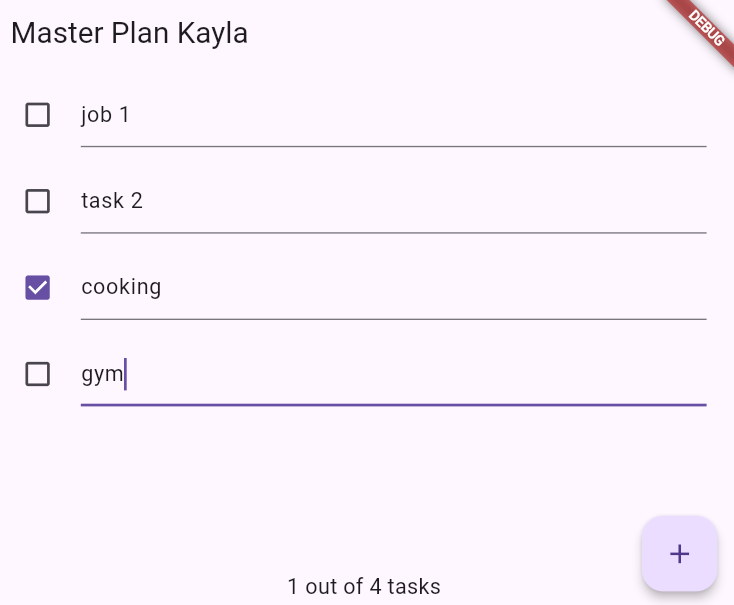

# master_plan

A new Flutter project.

## Praktikum 1

Menggunakan model-view dan stateful widget di Flutter untuk mengelola data tugas (task list). Hasilnya adalah aplikasi Master Plan yang menampilkan daftar tugas yang bisa ditambah, diedit, dan ditandai selesai secara dinamis.

## Praktikum 2

Memisahkan data dari tampilan menggunakan InheritedWidget dan InheritedNotifier. Data dari model Plan dikelola lewat PlanProvider, sehingga bisa diakses oleh widget lain dengan lebih efisien. Hasilnya, struktur aplikasi jadi lebih rapi dan state management-nya lebih terorganisir.

